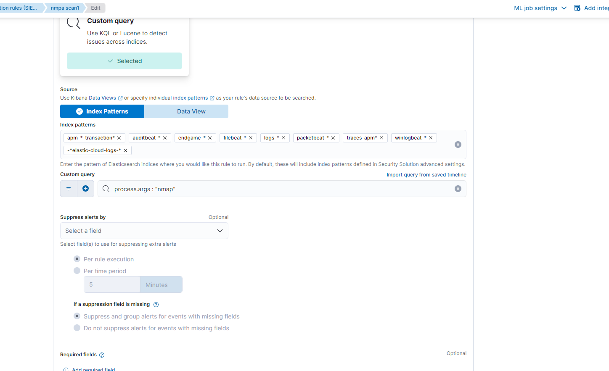

---

---
## Prerequisites:
*   Elastic Cloud account (free trial)
*   Kali Linux virtual machine (or similar Linux distribution)
*   Basic understanding of command-line interface and network concepts

## Installation 
1.  Create an Elastic Cloud account
2.  Set up a new deployment
3.  Configure Elastic Agent on Kali Linux
4.  Generate security events: Use Kali Linux tools or perform actions that generate security events (e.g., nmap scanner detector)
   
## Screenshots:

```
Long, single-line code blocks should not wrap. They should horizontally scroll if they are too long. This line should be long enough to demonstrate this.
```

```
Long, single-line code blocks should not wrap. They should horizontally scroll if they are too long. This line should be long enough to demonstrate this.
```

```
Long, single-line code blocks should not wrap. They should horizontally scroll if they are too long. This line should be long enough to demonstrate this.
```

```
Long, single-line code blocks should not wrap. They should horizontally scroll if they are too long. This line should be long enough to demonstrate this.
```
```

```
